## Tech Stack

## GitHub Stats

  
  

  

## Pinned Repositories

  
  
  
  
  
  

## My Projects
- [CDAT Pattern](https://github.com/dar-kow/cdat-pattern) - Components-Data-Actions-Tests: A modern 4-layer architecture for maintainable Playwright tests
- [Demo BI](https://github.com/dar-kow/demo-bi) - Modern BI system with Next.js 14 featuring analytics dashboards, data management and AI-powered insights
- [M-A-F](https://github.com/dar-kow/M-A-F) - My Invoice Application - React + .NET / Postgres with Playwright API tests
- [Portfolio](https://github.com/dar-kow/Portfolio) - Matrix-style effects portfolio SPA built with React
- [E2E UI Tests in Playwright - MAF](https://github.com/dar-kow/maf-e2e-pw) - UI tests for MAF application in Playwright / TypeScript
- [k6-tests](https://github.com/dar-kow/k6-tests) - API performance tests with k6
- [k6-dashboard](https://github.com/dar-kow/k6-dashboard) - Dashboard for k6 test results visualization - React + Express
- [Confluence Headers Manager](https://github.com/dar-kow/confluence-headers-manager-pro) - Header management and tracking for large Confluence documentation spaces
- [SDET.pl](https://www.sdet.pl) - In progress

